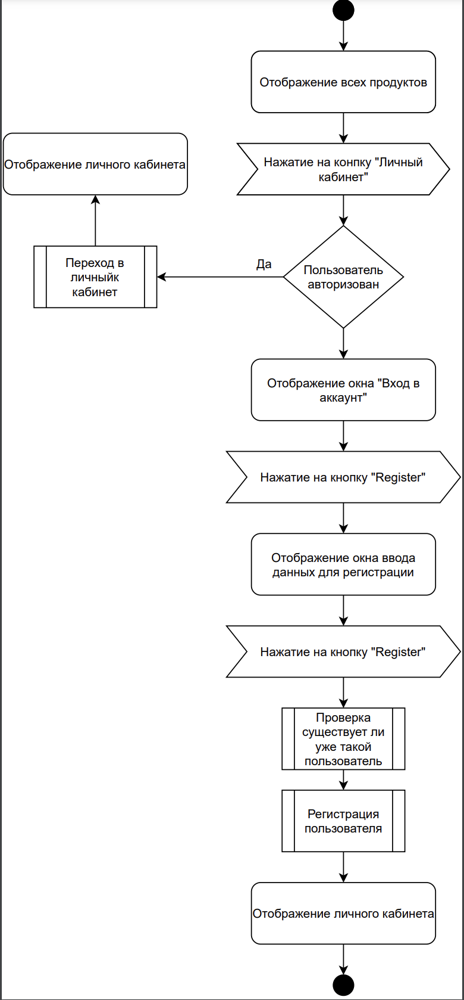
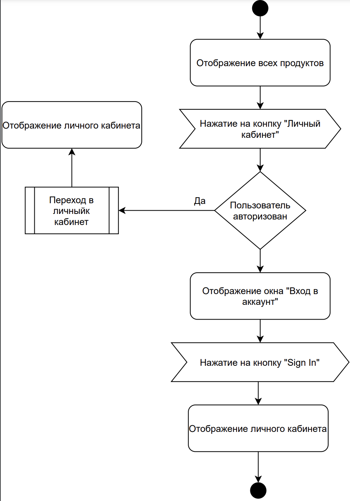
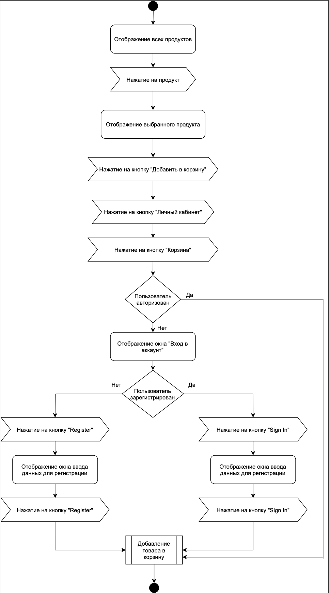
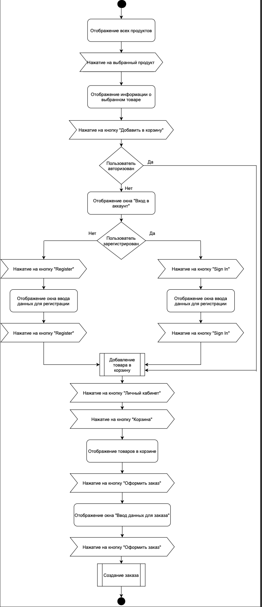

# Диаграммы активностей

# Содержание
1. [Регистрация в приложении](#1)
2. [Вход в учетную запись](#2)
3. [Добавление продукта в корзину](#3)
4. [Создание заказа](#4)

### 1. Регистрация в приложении

### 2. Вход в учетную запись

### 3. Добавление продукта в корзину

### 4. Создание заказа

