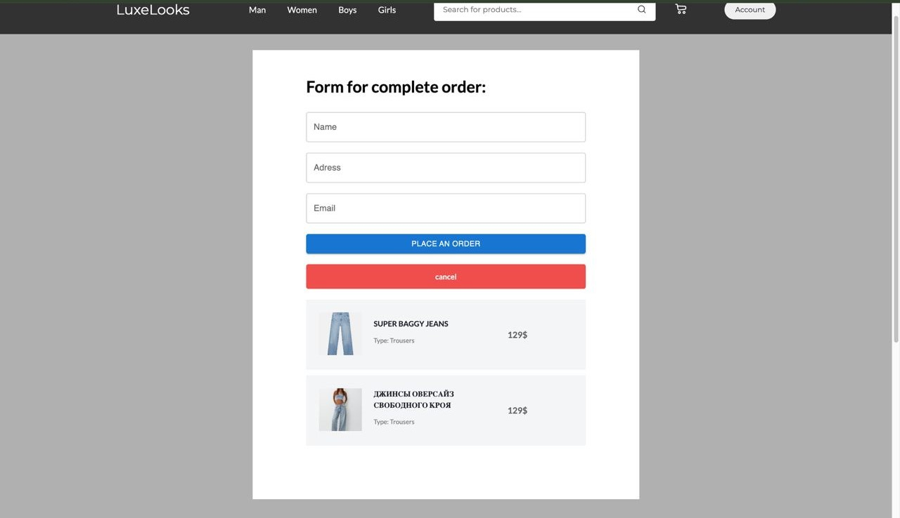
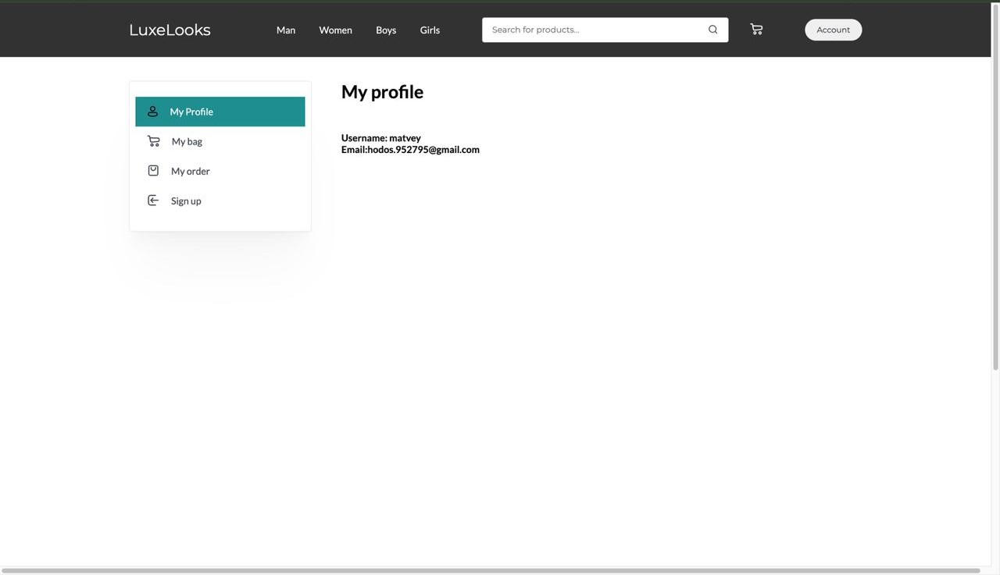

## Отчет по улучшениям UX 
### Оценка ПО по атрибутам качества
1. **Распознаваемость соответствия**: Высокий уровень. Все элементы интерфейса соответствуют ожиданиям пользователя. Пользователь сразу сможет понять, соответствует ли проект его потребностям.
2. **Обучаемость**:Высокий уровень. Пользователи не будут испытывать трудности при первом использовании, так как интерфейс интуитивно понятен.
3. **Используемость (операбельность)**: Пользовательский интерфейс удобныЙ для взаимодействия и навигации.
4. **Защита от ошибок пользователя**: Высокий уровень. Пользователи не должны допускать ошибки, так как интерфейс понятный. Присутствует валидация форм на случай ошибочного ввода пользователем личных данных.
5. **Эстетика GUI**: Средний уровень. Дизайн может быть улучшен для создания более приятного визуального восприятия. Возможно улучшение цветовой гаммы всего проекта.
6. **Доступность**: Уровень ниже среднего. Проект доступен на гитхабе вместе с API, базой данных и всей документацией. При скачивании проекта, он всегда будет находиться в работоспособном состоянии, если запущена API. 

### Пути улучшения UX
- Создание более приятного для визуального восприятия дизайна, единой цветовой гаммы. 
- Возможно выложить проект на сервер, тогда он будет в работоспособном состоянии достаточно длительно время (например, пока не произойдет сбой на сервере). Необходимо для повышения степени доступности.
- Добавление возможности вывести список с сортировкой. Необходимо для улучшения восприятия и уменьшения времени поиска товара.
- Добавление контекстных подсказок (например, о том, что товар добавлен в корзину, или о том, что отзыв не может оставить пользователь, не купивший товар). Необходимо для оповещения пользователя о его действиях (особенно важно при первом использовании).

### "До" vs. "После"

    

        
        
Карточки товаров До

    

    

        
        
Карточки товаров После

    

    

        
        
Оформление заказов До

    

    

        
        
Оформление заказов После

    

    

        
        
Профиль До

    

    

        
        
Профиль После

    

