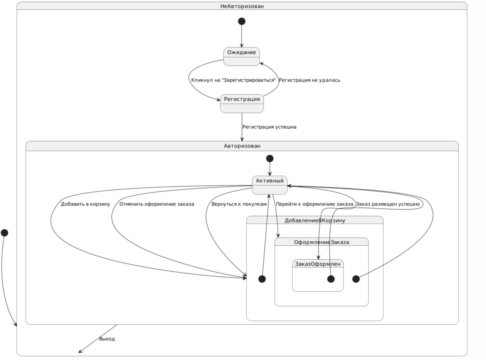
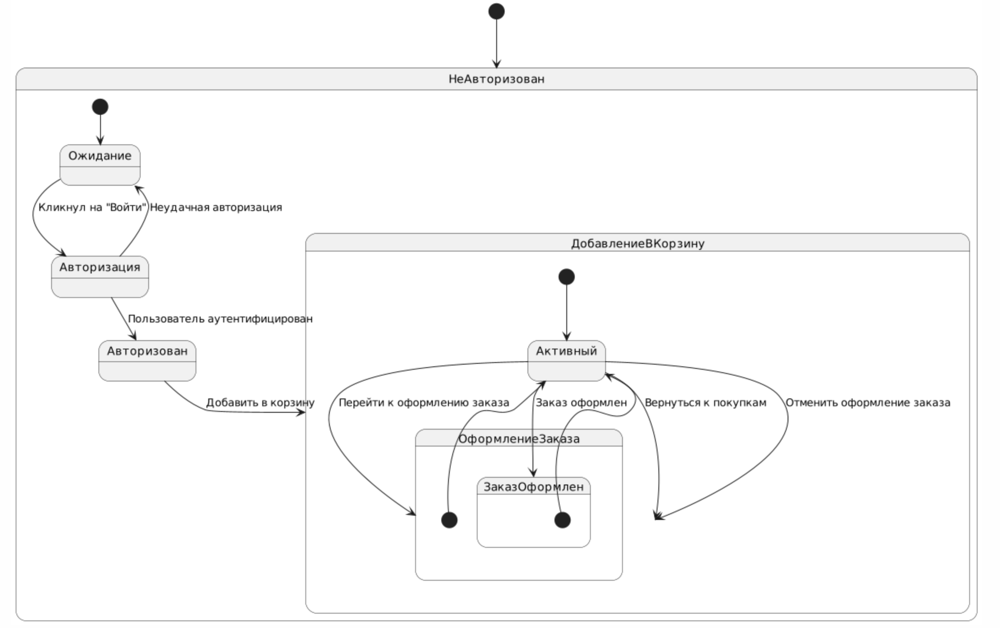
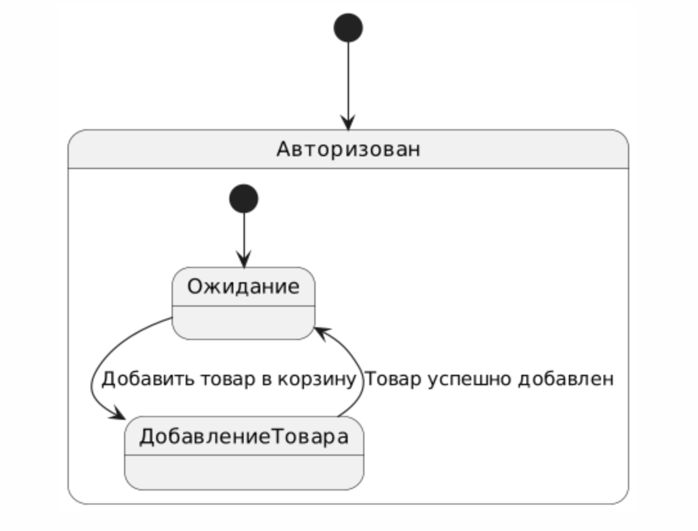
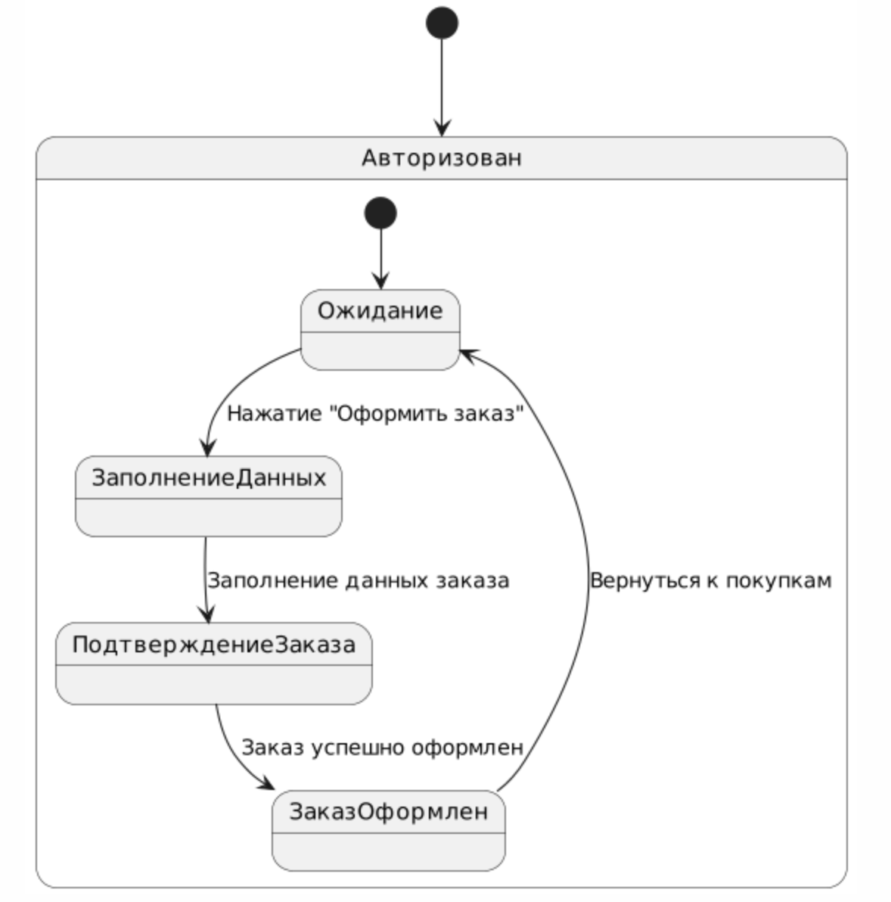

# Диаграммы состояний
---

# Содержание
1. [Регистрация](#1)
2. [Авторизация пользователя](#2)
3. [Добавление товара в корзину](#3)
4. [Оформление заказа](#4)

### 1. Регистрация

### 2. Авторизация пользователя

### 3. Добавление товара в корзину

### 4. Оформление заказа

