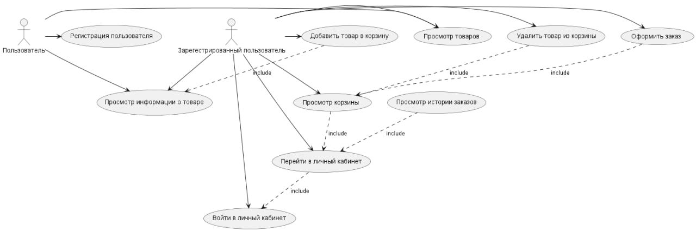

# Диаграмма вариантов использования

---

## Варианты использования

---

## 2.1 Войти в учётную запись

* Описание: Вариант использования "Войти в учётную запись" позволяет пользователю войти в учётную запись.
* Предусловия: Пользователь ранее создал учётную запись в приложении.
* Основной поток:
    1. Пользователь вводит имя и пароль в окне входа в учётную запись.
    2. Система проверяет правильность введенных данных.
    3. Если данные верны, система присваивает пользователю статус "зарегистрирован".
    4. Система отображает главное окно приложения.
* Альтернативный поток А1:
    1. Система отображает сообщение об ошибке и возвращает пользователя к окну входа в учётную запись.

## 2.2 Регистрация пользователя

* Описание: Вариант использования "Регистрация пользователя" позволяет пользователю создать новую учётную запись в приложении.
* Предусловия: Пользователь ранее не создал учётную запись в приложении.
* Основной поток:
    1. Пользователь вводит имя, адрес электронной почты и пароль в окне регистрации.
    2. Система проверяет уникальность имени пользователя.
    3. Если имя пользователя уникально, система создает новую учётную запись.
    4. Система присваивает пользователю статус "зарегистрирован".
    5. Система отправляет подтверждение регистрации на адрес электронной почты пользователя.
* Альтернативный поток А2:
    1. Система отображает сообщение об ошибке и возвращает пользователя к окну регистрации.

## 2.3 Просмотр товаров

* Описание: Вариант использования "Просмотр товаров" позволяет пользователю просмотреть список товаров в магазине.
* Предусловия: Пользователь вошёл в учётную запись.
* Основной поток:
    1. Система получает список товаров из базы данных.
    2. Система отображает список товаров в главном окне приложения.

## 2.4 Просмотр информации о товаре

* Описание: Вариант использования "Просмотр информации о товаре" позволяет пользователю просмотреть информацию о товаре по названию.
* Предусловия: Пользователь вошёл в учётную запись.
* Основной поток:
    1. Пользователь вводит название товара в строке поиска.
    2. Система ищет товар в списке товаров.
    3. Если товар найден, система отображает его информацию в главном окне приложения.
    4. Если товар не найден, система отображает сообщение об ошибке.

## 2.5 Добавить товар в корзину

* Описание: Вариант использования "Добавить товар в корзину" позволяет пользователю добавить товар в свою корзину.
* Предусловия: Пользователь вошёл в учётную запись.
* Основной поток:
    1. Пользователь выбирает товар в списке товаров и нажимает кнопку "Добавить в корзину".
    2. Система добавляет товар в корзину пользователя.
    3. Система обновляет список товаров в главном окне приложения.

## 2.6 Удалить товар из корзины

* Описание: Вариант использования "Удалить товар из корзины" позволяет пользователю удалить товар из своей корзины.
* Предусловия: Пользователь вошёл в учётную запись.
* Основной поток:
    1. Пользователь выбирает товар в корзине и нажимает кнопку "Удалить".
    2. Система удаляет товар из корзины пользователя.
    3. Система обновляет список товаров в корзине.

## 2.7 Просмотр корзины

* Описание: Вариант использования "Просмотр корзины" позволяет пользователю просмотреть список товаров в своей корзине.
* Предусловия: Пользователь вошёл в учётную запись.
* Основной поток:
    1. Система отображает список товаров в корзине пользователя.

## 2.8 Оформить заказ

* Описание: Вариант использования "Оформить заказ" позволяет пользователю оформить заказ на товары из своей корзины.
* Предусловия: Пользователь вошёл в учётную запись и добавил товары в корзину.
* Основной поток:
    1. Пользователь вводит адрес доставки и способ оплаты.
    2. Система проверяет данные заказа.
    3. Если данные верны, система отправляет заказ на обработку.
    4. Система отображает сообщение

